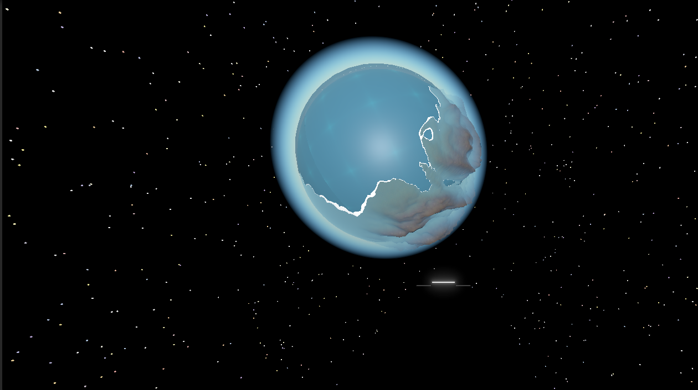
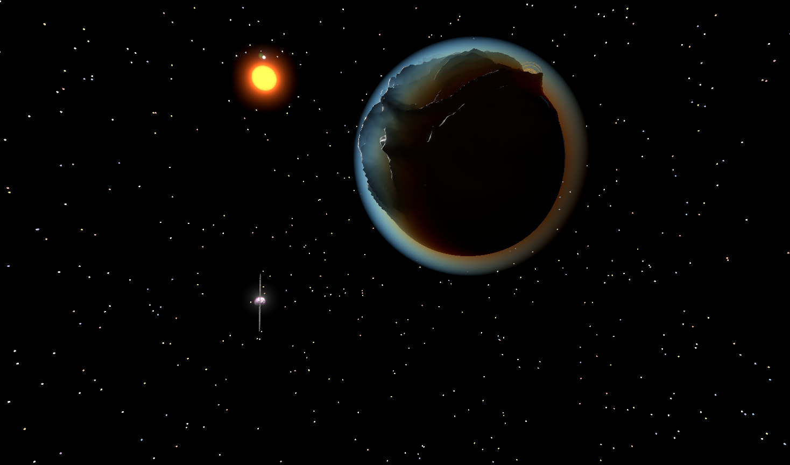
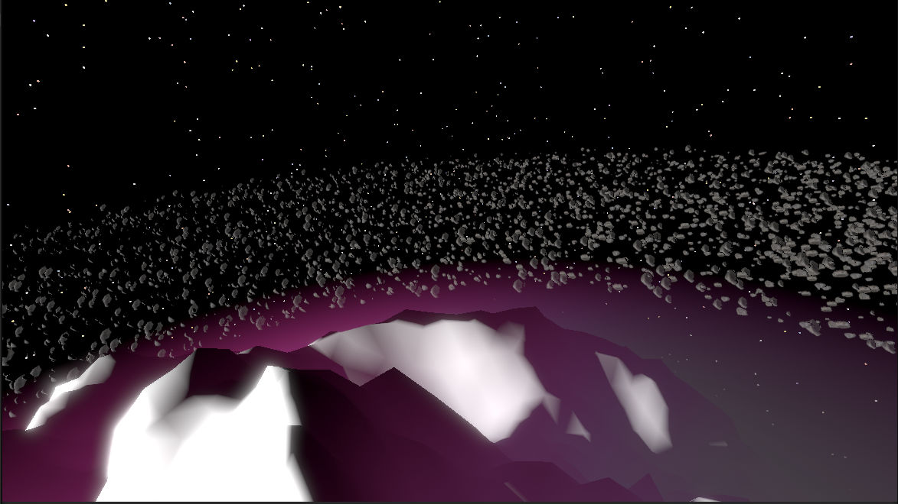
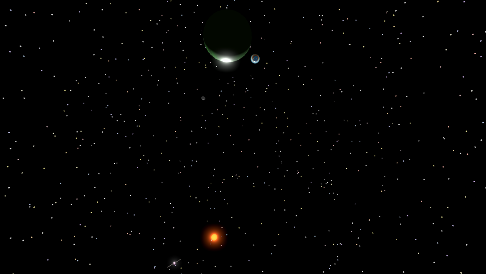
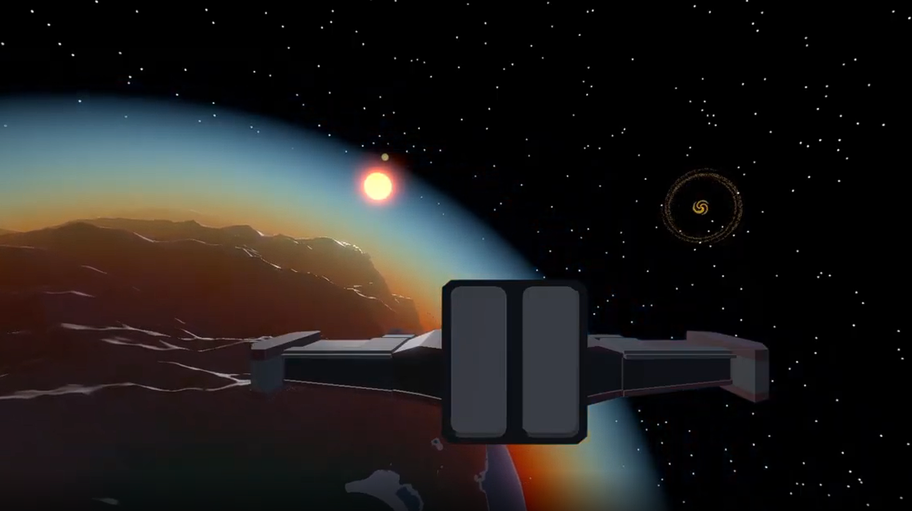

# The After World

## Fonctionnalités
The After World est un jeu développé sur Unity, c'est un jeu qui m'a permi
d'apprendre comment fonctionne les mouvements planétaires, la physique, les shaders. 
Il n'y a pas vraiment de but, on peut prendre un vaisseau pour se déplacer dans l'univers. 
L'inspiration vient du jeu **Outer Wilds**, des planètes réduites, des graphismes low poly. 

## Physique
La physique du jeu est basé sur semi-implicit Euler, je calcul l'attraction avec F = G * (m1 * m2) / r²  
j'applique ensuite la gravité avec AddForce, la physique est donc calculé réellement, les planètes orbitent de manière physiquement
réaliste.

## Rendu de planètes
Les planètes sont rendu procédurallement en utlisant [FastNoiseLite](https://github.com/Auburn/FastNoiseLite), j'utilise en réalité un fork qui le 
rend compatible avec **Burst** qui permet de rendre les planètes bien plus rapidemment, cela m'a permi d'apprendre comment fonctionne les jobs et 
l'optimisation, à l'origine j'avais mis un système qui permet en utilisant le GPU de rendre énormément d'herbe mais le rendu ne me convenait pas
il est encore possible de l'activer.   Les rendus des atmosphères sont fait avec les tutos de [Sebastian Lague](https://www.youtube.com/c/SebastianLague)
l'atmosphere utilise Rayleigh scattering permettant de rendre des amtmosphères qui réagissent avec la lumière.

## Images

